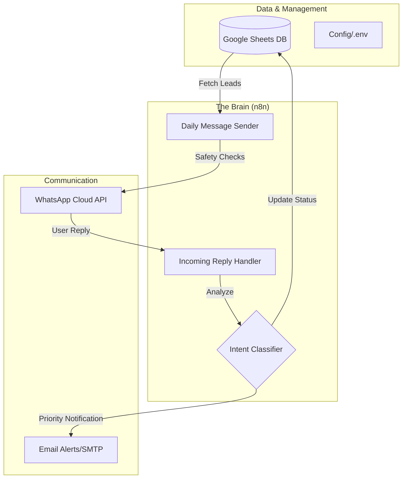

# 📱 WhatsApp Marketing Automation System


[](https://opensource.org/licenses/MIT)
[](https://n8n.io)
[](https://google.com/sheets)
[](https://www.whatsapp.com/business/)

**Transform your WhatsApp outreach with a professional-grade, self-hosted automation engine.** This project provides a robust, low-cost alternative to expensive CRM solutions by leveraging n8n, Google Sheets, and the WhatsApp Business API.

---

## 🌟 Why This System?

*   **💰 Zero Monthly Subscriptions**: Use 100% open-source and free-tier tools. No $99/mo CRM bills.
*   **📈 High Volume Scaling**: Safely send up to 10,000 messages/day with built-in rate limiting and safety checks.
*   **🎯 Intelligent Segmentation**: Automatically categorize leads into 5 segments (Hot, Warm, Cold, etc.) based on interaction.
*   **🤖 Intent Detection**: Rule-based logic to detect lead interest without expensive AI API costs.
*   **⚙️ Set & Forget**: 30-day automated follow-up sequences to keep your pipeline moving while you sleep.

---

## 🏗️ System Architecture



---

## 🚀 Core Features

| Feature | Description |
| :--- | :--- |
| **Safety Engine** | Automatic enforcement of daily message limits to prevent account flags. |
| **Temp-Based Messaging** | Tailored messaging templates for HOT, WARM, and COLD leads. |
| **Lead Validation** | Built-in JavaScript helper to validate international phone formats. |
| **Follow-up Logic** | Automated 30-day sequence ensuring no lead is left behind. |
| **Instant Alerts** | Real-time SMTP email notifications the moment a lead shows high intent. |
| **Audit Logging** | Every message and state change is logged back to your Google Sheet. |

---

## 🛠️ Technology Stack

*   **Orchestration**: [n8n](https://n8n.io) (Low-code workflow automation)
*   **Database**: Google Sheets API (Familiar, easy-to-edit interface)
*   **Messaging**: WhatsApp Business API (Official, scalable, reliable)
*   **Logic**: Node.js/JavaScript (Custom intent classification and validation)
*   **Deployment**: Docker-ready for Railway, VPS, or local hosting.

---

## 📋 Quick Start (5 Minutes)

### 1. Repository Setup
```bash
git clone https://github.com/adriansanthosh77-dev/Whatsapp-marketing-automation.git
cd whatsapp-marketing-automation
```

### 2. Environment Configuration
Copy the example config and add your credentials:
```bash
cp config/.env.example .env
```

### 3. Import Assets
- **Google Sheets**: Import templates from `google-sheets/sheet-templates/` to your drive.
- **n8n**: Open n8n (localhost:5678) and import JSON files from `n8n-workflows/`.

### 4. Go Live
Enable the workflows in n8n and watch your leads convert!

---

## 📖 Detailed Documentation

*   📘 [Complete Setup Guide](docs/SETUP_GUIDE.md) - Step-by-step from zero to hero.
*   📝 [Template Creation](docs/TEMPLATE_GUIDE.md) - How to write messages that convert.
*   🔌 [API Configuration](docs/API_CONFIGURATION.md) - Connecting WhatsApp & Google.
*   🛠️ [Troubleshooting](docs/TROUBLESHOOTING.md) - Common issues and fixes.

---

## 📊 What's Included?

- **2 Production-Ready Workflows**: Battle-tested n8n JSON exports.
- **4 Pro Sheet Templates**: Optimized for lead tracking and segmentation.
- **30+ Copywriting Templates**: High-converting WhatsApp message scripts.
- **JS Helper Utilities**: Logic for phone validation and intent classification.
- **Deployment Configs**: Docker & Railway templates for 24/7 operation.

---

## 🤝 Contributing

Contributions are welcome! If you have ideas for better intent detection or new templates, feel free to open a PR or Issue.

1. Fork the Project
2. Create your Feature Branch (`git checkout -b feature/AmazingFeature`)
3. Commit your Changes (`git commit -m 'Add some AmazingFeature'`)
4. Push to the Branch (`git push origin feature/AmazingFeature`)
5. Open a Pull Request

---

## 📝 License

Distributed under the MIT License. See `LICENSE` for more information.

---

<p align="center">
  <b>Built with ❤️ for the Open Source Marketing Community</b><br>
  If this project saved you time or money, please give it a ⭐ Star!
</p>
