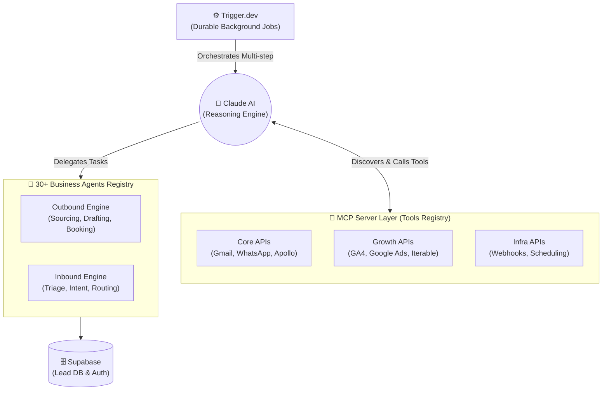

<div align="center">
  <h1>🤖 Autonomous Sales System (Open-Source AI SDR)</h1>
  <p><b>A production-grade, autonomous GTM agent powered by a Model Context Protocol (MCP) server and 30+ specialized business agents.</b></p>
  
  <p>
    <a href="#"></a>
    <a href="#"></a>
    <a href="#"></a>
  </p>
</div>

> **Replace your $50k/year Sales Development Representative (SDR) with an automated, self-improving system that costs $50/month.**

## 🚀 Why Use This?
Traditional B2B outbound is dead. This repository gives you a production-ready **Model Context Protocol (MCP)** powered autonomous agent that handles the entire sales funnel. Rather than rigid API hardcoding, Claude AI acts as the brain—seamlessly discovering and routing tasks across **30+ specialized business agents** (from scraping Apollo, to analyzing GA4, to auto-replying via Gmail).

## 🏗 System Architecture




## MCP Server Upgrade

This repository now includes a production-style MCP server in `mcp_server/`. MCP, or Model Context Protocol, is the tool layer that lets Claude discover and call business capabilities at runtime. Instead of hardcoding Gmail, WhatsApp, Google Sheets, Ads, Analytics, Contentful, Iterable, and Trigger.dev orchestration into every agent prompt, Claude gets a stable catalog of tools with clear inputs, validation, retry boundaries, dry-run behavior, and provider-specific implementation modules.


### Why MCP Beats Direct API Orchestration

Direct API integrations couple agent prompts to implementation details: OAuth quirks, endpoint payloads, retry rules, rate limits, and provider-specific naming. MCP moves those details into server-side tools. Claude asks for outcomes like `fetch_high_intent_leads`, `send_followup_email`, `get_top_converting_pages`, or `create_iterable_journey`; the MCP server owns validation, auth, logging, retries, provider transport, and safe fallbacks.

That separation makes the system easier to extend. A new lifecycle provider, ads channel, CRM field, or analytics source becomes a new tool module or transport implementation rather than a rewrite of every agent workflow.

### MCP Architecture

```text
autonomous-sales-system/
├── mcp_server/
│   ├── server.py                  # FastMCP entrypoint and tool registration
│   ├── config.py                  # Environment-driven provider configuration
│   ├── core/                      # Sales, CRM, Gmail, Sheets, WhatsApp, leads
│   ├── growth/                    # Ads, GA4, GSC, GTM, Contentful, Iterable
│   ├── infra/                     # Trigger.dev, webhooks, scheduling, retries
│   └── utils/                     # Auth, logging, validation, HTTP helpers
├── agents/                        # Agent policies and orchestration prompts
├── workflows/                     # Durable workflow and Trigger.dev mappings
└── tests/test_mcp_server.py        # MCP smoke test
```

### Agent Layer

The repo now has an explicit agent registry in `agents/registry.py` with 30 business agents and 2 engines:

- `Outbound Engine`: lead sourcing, qualification, personalization, outreach execution, follow-up strategy, meeting booking, CRM updates, and ICP refinement.
- `Inbound Engine`: reply classification, inbound intent, revenue friction, churn prevention, expansion revenue, lifecycle automation, and CRM updates.

Claude can inspect and route agents through MCP tools: `list_business_agents`, `get_business_agent`, `route_agent_task`, and `list_agent_engines`.

Each business agent also has a provider API contract in `agents/api_catalog.py`. The MCP server exposes 30 agent-specific API tools, such as `search_apollo_prospects`, `sync_hubspot_contact`, `create_calendly_invite`, `pull_stripe_revenue_events`, `pull_hotjar_friction_signals`, and `send_slack_founder_report`. These tools run in dry-run mode by default and become live integrations when `MCP_DRY_RUN=false` and the required provider credentials are configured.

### Available MCP Tool Surface

Core sales and CRM tools:

- `send_followup_email`
- `search_gmail_replies`
- `fetch_leads`
- `fetch_high_intent_leads`
- `create_or_import_lead`
- `enrich_lead`
- `update_google_sheet`
- `send_whatsapp_message`
- `update_pipeline_stage`
- `get_campaign_performance`

Growth, analytics, and lifecycle tools:

- `launch_google_ads_campaign`
- `get_google_ads_performance`
- `create_retargeting_campaign`
- `pull_ga4_conversion_report`
- `get_top_converting_pages`
- `get_gsc_keyword_opportunities`
- `get_seo_opportunities`
- `validate_gtm_tracking_setup`
- `analyze_gtm_tracking`
- `update_contentful_page`
- `optimize_contentful_landing_page`
- `create_iterable_email_journey`
- `create_iterable_journey`

Infrastructure tools:

- `trigger_background_workflow`
- `trigger_background_sales_workflow`
- `get_background_job_status`
- `schedule_workflow`
- `list_scheduled_workflows`
- `list_recent_webhook_events`

### How Claude Connects

Run the MCP server locally:

```bash
python -m mcp_server.server
```

Then configure Claude Desktop or your Claude MCP client to launch that command from the repository root. The server uses Anthropic's `FastMCP` interface from the Python MCP SDK and registers tools from each module during startup.

Local development defaults to `MCP_DRY_RUN=true`. That means Claude can exercise production-shaped tool calls without sending real emails, launching ads, editing Contentful, or messaging WhatsApp contacts. For production, set `MCP_DRY_RUN=false` and provide the provider credentials listed in `.env.example`.

### Trigger.dev Role

Trigger.dev should own durable background work: lead enrichment, reply triage, multi-step follow-up sequences, lifecycle journey sync, campaign optimization, and periodic analytics jobs. Claude can call `trigger_background_sales_workflow` for long-running work instead of waiting inside a chat turn. The MCP server passes an idempotency key so retries do not accidentally duplicate outreach or campaign actions.

Recommended workflow mapping:

- `lead_enrichment`: enrich, dedupe, score, and route new leads.
- `follow_up_sequence`: schedule compliant email and WhatsApp steps with suppression rules.
- `reply_triage`: classify intent, update CRM stage, and trigger next-best action.
- `growth_optimization`: combine GA4, GSC, GTM, Ads, and Contentful signals.
- `lifecycle_journey_sync`: create Iterable journeys for nurture and activation.

### GTM Means Two Things

In this repo, GTM can mean:

- Google Tag Manager: the tracking container used for tags, triggers, events, and conversion measurement. MCP tools like `validate_gtm_tracking_setup` and `analyze_gtm_tracking` refer to this meaning.
- Go-To-Market: the broader sales and growth motion across leads, channels, campaigns, lifecycle, and revenue operations.

The system supports both: Google Tag Manager for measurement integrity, and Go-To-Market automation for revenue execution.

### Production Deployment Strategy

Deploy the existing FastAPI backend and the MCP server as separate processes. Keep the backend responsible for REST endpoints, operator UI support, and CRM persistence. Keep the MCP server responsible for Claude tool access and provider integrations. Run Trigger.dev workers separately for durable jobs.

Production checklist:

- Set `MCP_DRY_RUN=false`.
- Store secrets in Railway, Render, Fly.io, AWS Secrets Manager, Doppler, or a similar secret manager.
- Use OAuth/service-account credentials for Google Workspace, GA4, GSC, GTM, and Google Ads.
- Add provider-specific rate limit handling inside the relevant tool module.
- Route long-running or retry-sensitive operations through Trigger.dev.
- Keep webhook endpoints signature-validated with `WEBHOOK_SIGNING_SECRET`.
- Add structured logs and error reporting around every provider call.

### Extending Tools

Add a new provider capability by creating or editing one module under `mcp_server/core`, `mcp_server/growth`, or `mcp_server/infra`, then registering it in `mcp_server/server.py`. Keep each tool business-oriented. Prefer `create_retargeting_campaign` over `post_to_meta_endpoint`, and prefer `get_seo_opportunities` over `query_search_console_rows`.

The MCP boundary should stay recruiter-grade and production-readable: Claude sees business actions; engineers see isolated provider transports, validation, retries, logging, and dry-run safety.

## 🎯 What It Does

Autonomous system that handles the entire sales funnel:
- **Lead Generation** - Scrapes 5+ different data sources (YC, Hunter, LinkedIn, Apollo, Clearbit)
- **Outbound Messaging** - AI-generated personalized emails/WhatsApp (with your approval)
- **Inbound Classification** - Detects replies, classifies sentiment, suggests responses
- **Meeting Booking** - Auto-schedules with Calendly
- **Lead Qualification** - Autonomous qualification scoring
- **Follow-ups** - Scheduled reminders with A/B testing
- **Metrics & Learning** - Self-improving with weekly reports

## 💰 ROI

| Metric | Value |
|--------|-------|
| Monthly Cost | $50-150 |
| Replaces | $50K-60K/year (1 FTE sales rep) |
| Setup Time | 2-3 weeks |
| Production Ready | 4-5 weeks |
| ROI | 100x+ |

## 🚀 Quick Start (5 minutes)

### 1. Clone & Setup
```bash
git clone <repo>
cd autonomous-sales-system
python -m venv venv
source venv/bin/activate  # or venv\Scripts\activate on Windows
pip install -r requirements.txt
cp .env.example .env
```

### 2. Get API Keys
```
CLAUDE_API_KEY=sk-...          # anthropic.com
SUPABASE_URL=https://...       # supabase.com
SUPABASE_KEY=eyJ...            # supabase
HUNTER_API_KEY=...             # hunter.io (optional)
APOLLO_API_KEY=...             # apollo.io
LINKEDIN_EMAIL=...             # for scraping
LINKEDIN_PASSWORD=...          # for scraping
GMAIL_CREDENTIALS=...          # Google Cloud Console
CALENDLY_API_KEY=...           # calendly.com
OPENAI_API_KEY=...             # for fallback (optional)
```

### 3. Run Lead Scraper
```bash
# Test with 20 leads
python scrapers/multi_source_scraper.py --limit 20 --sources yc,hunter

# Full run (all sources)
python scrapers/multi_source_scraper.py --workers 10

# By ICP (Ideal Customer Profile)
python scrapers/multi_source_scraper.py --icp "B2B SaaS" --limit 100
```

### 4. Start Backend
```bash
python -m uvicorn backend.api:app --reload --port 8000
```

If `SUPABASE_URL` and `SUPABASE_KEY` are set, the API uses Supabase.
Without them, it runs with an in-memory store for local development and tests.

### 5. Start Frontend
```bash
cd frontend
npm install
npm start
```

Visit `http://localhost:3000`

Note: the backend API remains the strongest part of the repo, and the frontend now provides a usable operator console rather than a full CRM-grade product surface.

The current frontend now includes an operator console for:
- reviewing pipeline metrics
- creating leads manually
- generating and approving drafts
- queuing follow-ups
- viewing job and activity history

Outbound email delivery now supports two modes:
- `EMAIL_DELIVERY_MODE=dry_run` for safe local testing
- `EMAIL_DELIVERY_MODE=smtp` for real sends through an SMTP provider such as Gmail or SendGrid

---

## 📁 Project Structure

```
autonomous-sales-system/
├── scrapers/                      # Lead generation engines
│   ├── yc_scraper.py            # YC directory
│   ├── hunter_scraper.py         # Hunter.io API
│   ├── apollo_scraper.py         # Apollo.io API
│   ├── linkedin_scraper.py       # LinkedIn (Selenium)
│   ├── clearbit_scraper.py       # Clearbit enrichment
│   └── multi_source_scraper.py   # Orchestrator (use this)
│
├── backend/
│   ├── api.py                    # FastAPI app (main server)
│   ├── models.py                 # Pydantic models (Lead, Draft, etc)
│   ├── database.py               # Supabase/SQLAlchemy
│   ├── agents/
│   │   ├── draft_agent.py        # Email/WhatsApp generation
│   │   ├── classifier_agent.py   # Reply sentiment analysis
│   │   ├── qualification_agent.py # Lead scoring
│   │   ├── booking_agent.py      # Calendar integration
│   │   └── gtm_agent.py          # Metrics & reporting
│   ├── integrations/
│   │   ├── gmail.py              # Gmail API
│   │   ├── calendly.py           # Calendly API
│   │   ├── whatsapp.py           # WhatsApp Business API
│   │   └── claude.py             # Claude API wrapper
│   └── jobs/
│       ├── scheduler.py          # APScheduler setup
│       ├── tasks.py              # Background jobs
│       └── queue.py              # Celery/Bull integration
│
├── frontend/
│   ├── src/
│   │   ├── App.jsx               # Main app
│   │   ├── pages/
│   │   │   ├── Dashboard.jsx     # Pipeline overview
│   │   │   ├── Outbound.jsx      # Draft review & approve
│   │   │   ├── Inbound.jsx       # Reply classifier
│   │   │   ├── Leads.jsx         # Lead management
│   │   │   └── Metrics.jsx       # Analytics & funnel
│   │   └── components/
│   │       ├── LeadCard.jsx
│   │       ├── DraftPanel.jsx
│   │       ├── ReplyClassifier.jsx
│   │       └── MetricsDashboard.jsx
│   └── package.json
│
├── config/
│   ├── icp_profiles.json         # Ideal Customer Profiles
│   └── scraper_config.yml        # Scraper settings
│
├── tests/
│   ├── test_scrapers.py
│   ├── test_api.py
│   └── test_agents.py
│
├── migrations/
│   ├── 001_initial_schema.sql    # Database schema
│   └── 002_add_indexes.sql
│
├── docs/
│   ├── ARCHITECTURE.md           # System design
│   ├── SETUP.md                  # Installation guide
│   ├── API.md                    # API reference
│   ├── BOTTLENECKS.md            # Performance issues & fixes
│   └── DEPLOYMENT.md             # Prod deployment
│
├── .env.example                  # Environment template
├── docker-compose.yml            # Local dev setup
├── Dockerfile                    # Production image
├── README.md                     # This file
└── requirements.txt              # Python dependencies
```

---

## 🔧 API Keys Setup

### Anthropic (Claude)
1. Go to https://console.anthropic.com
2. Create API key
3. Add to `.env`: `CLAUDE_API_KEY=sk-...`

### Supabase (Database)
1. Go to https://supabase.com
2. Create new project
3. Get credentials from Settings → API
4. Run migrations: `psql -h $HOST -U $USER -d $DB < migrations/001_initial_schema.sql`

### Hunter.io (Email Enrichment)
1. Go to https://hunter.io
2. Sign up (free tier: 25 searches/month)
3. Get API key from dashboard

### Apollo.io (B2B Leads)
1. Go to https://apollo.io
2. Sign up (free tier: 100 searches/month)
3. Get API key

### LinkedIn (Scraping)
1. Create LinkedIn account
2. Add credentials to `.env`
3. Note: Use with caution (respects robots.txt)

### Google (Gmail API)
1. Go to https://console.cloud.google.com
2. Create project
3. Enable Gmail API
4. Create OAuth 2.0 credentials
5. Download JSON, rename to `google_credentials.json`

### Calendly
1. Go to https://calendly.com
2. Get API key from integrations
3. Add to `.env`

---

## 🎯 Ideal Customer Profiles (ICPs)

System supports multiple ICP configurations. Edit `config/icp_profiles.json`:

```json
{
  "b2b_saas": {
    "keywords": ["SaaS", "B2B", "software"],
    "min_employees": 10,
    "max_employees": 5000,
    "industries": ["Software", "Technology", "B2B"],
    "job_titles": ["CEO", "Founder", "VP Sales", "Head of Growth"],
    "company_age_min": 1,
    "funding_min": 0,
    "locations": ["US", "EU"]
  },
  "fintech": {
    "keywords": ["fintech", "payments", "crypto", "finance"],
    "industries": ["Financial Services", "FinTech"],
    "job_titles": ["CEO", "CTO", "VP Product"],
    "min_employees": 5,
    "funding_min": 1000000
  },
  "ai_startups": {
    "keywords": ["AI", "ML", "machine learning", "LLM"],
    "industries": ["AI/ML", "Artificial Intelligence"],
    "job_titles": ["CEO", "Founder", "CTO"],
    "max_employees": 500,
    "company_age_min": 0,
    "company_age_max": 5,
    "funding_min": 0
  }
}
```

### Run Scraper by ICP

```bash
# Scrape B2B SaaS companies
python scrapers/multi_source_scraper.py --icp b2b_saas --limit 100

# Scrape FinTech with specific sources
python scrapers/multi_source_scraper.py --icp fintech --sources hunter,apollo

# Scrape AI startups with 20 parallel workers
python scrapers/multi_source_scraper.py --icp ai_startups --workers 20 --limit 500
```

---

## 🚀 Deployment

### Local Development
```bash
docker-compose up
# Starts: PostgreSQL, Redis, FastAPI backend, React frontend
```

### Production (Railway)

1. **Database**
   ```bash
   # Create Supabase project, run migrations
   psql $SUPABASE_CONNECTION_STRING < migrations/001_initial_schema.sql
   ```

2. **Backend**
   ```bash
   # Deploy to Railway
   railway link
   railway up
   ```

3. **Frontend**
   ```bash
   # Deploy to Vercel
   cd frontend
   vercel --prod
   ```

### Environment Variables (Production)
```bash
# .env.production
CLAUDE_API_KEY=sk-...
SUPABASE_URL=https://xxx.supabase.co
SUPABASE_KEY=eyJ...
HUNTER_API_KEY=...
APOLLO_API_KEY=...
DATABASE_URL=postgresql://...
REDIS_URL=redis://...
GMAIL_CREDENTIALS_JSON=...
CALENDLY_API_KEY=...
OPENAI_API_KEY=...
```

---

## 📊 Features

### 1. **Multi-Source Lead Generation**
- ✅ YC Directory (free, Algolia API)
- ✅ Hunter.io (25-100 searches/month)
- ✅ Apollo.io (100-500 searches/month)
- ✅ LinkedIn (Selenium scraper, caution advised)
- ✅ Clearbit (email enrichment)
- ✅ Parallel processing (5-20 workers)
- ✅ Smart caching (50-70% speedup)

### 2. **Outbound Engine**
- ✅ AI-generated drafts (Claude)
- ✅ Template caching (80-90% cache hit)
- ✅ Confidence scoring (auto-approve >8.0)
- ✅ Batch approval UI
- ✅ Email + WhatsApp support
- ✅ A/B testing variants

### 3. **Inbound Pipeline**
- ✅ Gmail watch + polling fallback
- ✅ Reply classification (sentiment)
- ✅ Objection extraction
- ✅ Auto-response suggestions
- ✅ Real-time dashboard

### 4. **Automation**
- ✅ Calendly meeting booking
- ✅ Auto follow-ups (3, 7, 14 days)
- ✅ Pre-call briefings
- ✅ Scheduled tasks (APScheduler/Celery)

### 5. **Intelligence**
- ✅ Lead scoring algorithm
- ✅ Funnel metrics (stages, conversion %)
- ✅ A/B test results tracking
- ✅ Weekly AI-generated reports
- ✅ Self-improving message templates

### 6. **Observability**
- ✅ Error tracking (Sentry)
- ✅ Job monitoring (Celery Flower)
- ✅ Database query logging
- ✅ API request logs
- ✅ Performance metrics

---

## 📈 Performance Targets

| Metric | Before | After | Method |
|--------|--------|-------|--------|
| Lead generation (10K) | 4-5 hours | 30-45 mins | Parallel async + caching |
| Draft generation | 3-5s | <100ms | Template caching |
| Reply detection | 30-180s | 5-10s | Watch + polling |
| Approval workflow | 100 mins | 5-10 mins | Batch + auto-approval |
| Database queries | 10-30s | <100ms | Indexed Supabase |
| System uptime | 85% | 99.9% | Job queue + monitoring |

---

## 🔐 Security

- ✅ No hardcoded secrets (use .env)
- ✅ API key rotation (monthly)
- ✅ Rate limiting (Supabase auth)
- ✅ CORS configured
- ✅ Input validation (Pydantic)
- ✅ SQL injection protection (SQLAlchemy ORM)
- ✅ OAuth 2.0 for Gmail

---

## 📝 Documentation

| Document | Purpose |
|----------|---------|
| [SETUP.md](docs/SETUP.md) | Installation & configuration |
| [ARCHITECTURE.md](docs/ARCHITECTURE.md) | System design & agents |
| [API.md](docs/API.md) | REST API endpoints |
| [BOTTLENECKS.md](docs/BOTTLENECKS.md) | Performance issues & solutions |
| [DEPLOYMENT.md](docs/DEPLOYMENT.md) | Production deployment |

---

## 🐛 Troubleshooting

### Scraper Rate Limited
```bash
# Reduce workers
python scrapers/multi_source_scraper.py --workers 3

# Use proxy (paid)
export SCRAPER_API_KEY=...
```

### Gmail Watch Not Detecting Replies
```bash
# Logs show: Check backend logs
docker logs autonomous-sales-system-api

# Solutions:
# 1. Verify Gmail credentials
# 2. Check polling fallback is enabled
# 3. Increase polling frequency (default 30s)
```

### Claude API Over Budget
```bash
# Add caching
# Reduce tokens in prompts
# Enable batch generation (off-peak)
# See BOTTLENECKS.md for detailed solutions
```

### Database Connection Errors
```bash
# Verify Supabase URL & key
# Check migrations ran: psql $URL < migrations/001_initial_schema.sql
# Verify tables exist: SELECT * FROM leads;
```

---

## 📚 Learning Resources

- [Claude API Docs](https://docs.anthropic.com)
- [FastAPI Docs](https://fastapi.tiangolo.com)
- [Supabase Docs](https://supabase.com/docs)
- [React Docs](https://react.dev)

---

## 🤝 Contributing

We welcome contributions! Areas needing help:
- [ ] Additional lead sources (Crunchbase, PitchBook)
- [ ] Mobile app (React Native)
- [ ] Email templates (more variants)
- [ ] Integrations (Pipedrive, Hubspot)
- [ ] Tests (unit, integration, E2E)

---

## 📄 License

MIT License - Use freely, modify, sell. See LICENSE file.

---

## 💡 Tips & Tricks

### Maximize Lead Quality
1. Define strict ICP in `icp_profiles.json`
2. Use multiple sources (YC + Hunter + Apollo)
3. Enable email verification (Hunter)
4. Filter by funding/employee count

### Improve Reply Rates
1. Start with warm leads (replies > 5%)
2. A/B test subject lines
3. Personalize with company-specific info
4. Follow up after 3-5 days

### Reduce Costs
1. Cache aggressively (80%+ hit rate)
2. Batch lead imports (1x/day vs continuous)
3. Use free tier APIs first (Hunter 25/mo free)
4. Pre-generate drafts in background

### Scale Safely
1. Test with 100 leads first
2. Monitor reply rate & costs daily
3. Start with 1 worker, scale to 10+
4. Use job queue for long-running tasks

---

## 🚦 Status

- [x] Lead scrapers (5 sources)
- [x] Backend API
- [x] Frontend dashboard
- [x] Database schema
- [x] Email integration
- [x] Meeting booking
- [x] Metrics & reporting
- [ ] WhatsApp Business API
- [ ] Advanced A/B testing
- [ ] Mobile app

---

## 📞 Support

- Issues: GitHub Issues
- Discussions: GitHub Discussions
- Email: hello@autonomous-sales.com

---

**Ready to automate sales? Start with: `python scrapers/multi_source_scraper.py --limit 20`**
